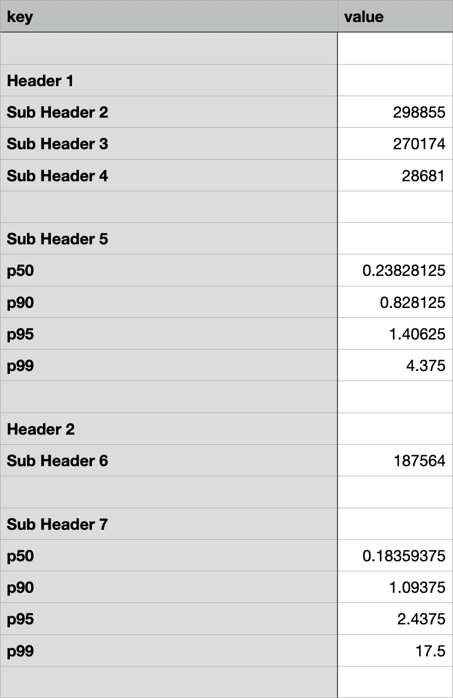

# New Relic Crawler
New Relic Crawler is a small python script created to pull values from new relic and store them in both json files and csvs.
While the json files are generic and be parsed may ways, the csv files are use case specific.

## Install Requirements
All requirements can be installed via pip and are listed in the requirements.txt file.
It should be noted that this script was written and tested using python version 3.7.0 

To install requirements via pip:
```bash
pip install -r requirements.txt
```

## Run
To run the New Relic Crawler, just run the crawler.py file. The script requires a few input variables, they are:
* `api-key` this is the api key used for new relic
* `accountId` this is the account id for new relic
* `inputFile` this is the path to the input files (more on input files in the appendix)
* `jsonFile` this is the path to the temp json files
* `outputFile` this is the path to the output csvs

The form to invoke the crawler looks like this
```bash
python crawler.py --apiKey xyzxyz --accountId 123123 --inputFile path/to/input/file/dir/ --jsonFile path/to/json/file/dir --outputFile path/to/json/file/dir
```

## Appendix
### Creating Input Files
Input files are pretty basic, they are pipe delimited text files that follow the following form:
```bash
header|subheader|metric name|sql safe query|time clause
```

Definitions
* `header` This is a header which is used in labeling the csvs, only the first row classified under this header needs to have the header
* `subheader` This is a subheader which is used in labeling the csvs, all rows need a sub header, this is how the metric is labeled in the csv
* `metric name` This is the name of the metric, and is used internally
* `sql safe query` This is a sql safe query without the time clause. It should be noted that any name with a `-` is not sql safe and will need to be wrapped in back tics 
* `time clause` This is the time clause of the sql query

### Types of New Relic responses supported
As it stands now, the new relic parser can only parse three types of responses, they are as follows.

#### Single Score
```json
[
  {
    "SomeKey": 50802
  }
]
```

#### P9X Forms
```json
[
  {
    "someKey": {
      "50": 0.50,
      "90": 0.90,
      "95": 0.95,
      "99": 0.99
    }
  }
]
```

#### True/False Facets
```json
[
  {
    "someKey": "True",
    "count": 90073,
    "facet": "True"
  },
  {
    "someKey": "False",
    "count": 2189,
    "facet": "False"
  }
]
```

###Sample Output File
To give an idea of what the csv files look like, and how headers and sub headers are populated, take a look at the following


